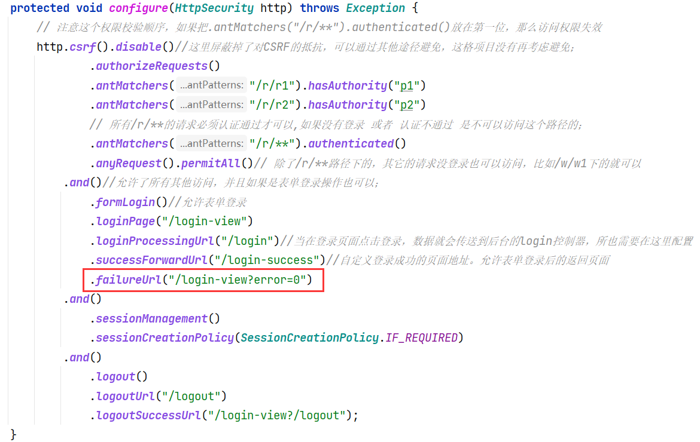
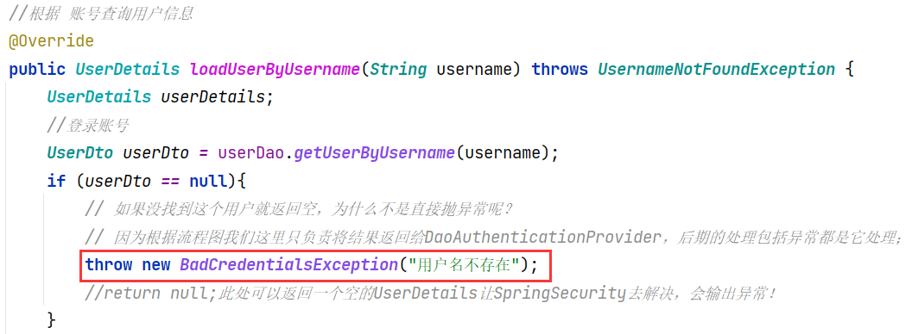

注：因为所有的SpringBoot项目都需要添加一个父项目依赖：

```java
<parent>
    <groupId>org.springframework.boot</groupId>
    <artifactId>spring-boot-starter-parent</artifactId>
    <version>2.1.3.RELEASE</version>
</parent>
```

​    但是由于我的这个项目module建在了SpringSec_Deno中了，所以再这个项目下建的module都是这个项目的子项目，所以这里新建的子项目springBoot_security_demo项目就需要有一个依赖：


```java
<parent>
    <artifactId>SpringSec_Deno</artifactId>
    <groupId>com.SpringSec.damo</groupId>
    <version>1.0-SNAPSHOT</version>
</parent>
```

但是maven 规定一个项目只能有一个父项目，所以只能将SpringBoot的父项目依赖放到SpringSec_Demo项目的依赖文件中。

如果以后想将这个SpringBoot项目独立出来，需要删除这个指定SpringSec_Demo父项目依赖（源代码框2），将SpringBoot的父依赖（源代码框1）放到springBoot_security_demo3项目依赖中.

## 简介

- 实现对用户所具有的**权限从数据库中查询**，通过Dao中的：findPermissionsByUserId(String userId)方法查询权限，封装到UserDetails中。

- 实现了当用户访问：*项目名/logout* 就自动跳转到登录表单的操作。

- 在这个项目尝试了web授权和方法授权。(仅仅是尝试了，项目中具体使用的授权还是web授权)

-  实现了当用户输入错误的用户名或者密码，会在网页上进行提示，实现的形式是：

  ​     当用户输入错误的账号或者密码会给前端返回一个url上带着error=0的参数，前端根据这个参数判断来提示用户账号或者密码错误；

  实现的方式是：

  ​     在安全配置类中，http配置中添加一个.failureUrl("/login-view?error=0")函数，当后端对用户输入的账号或者密码匹配错误时，就会自动使用这个函数返回登录界面并且带上参数error；这个函数必须跟在登录等操作函数的后边才可以：

  

  ​     这个项目（springboot_security_demo4）使用的直接URL处理登录错误，后一个项目springboot_security_demo5使用了登录错误处理类Hander来处理，更具有拓展性；

- 未实现：

  - 用户输入的账号不存在将报出异常不能解决，抛出异常是因为使用用户输入的用户名去数据库中查询，查询不到返回了空的用户实体，于是又将这个空的实体当作userDetails给Spring Security返回了过去，将异常处理的过程交给了它来处理，其他可以使用捕获异常来解决；

