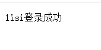

## 一、项目初始化

1、运行方法使用编译器上面的运行或者debug模式。不过首次初创建项目的时候，因为使用的是SpringMVC + servlet3.0模式，集成了tomcat运行，所以在pom文件中配置了tomcat插件，所以，初次运行时，使用maven插件运行：


在运行配置中，选择maven运行，配置name，找到工作路径（项目路径），输入命令：clean tomcat7:run即可；

**因为项目内置了tomcat7，所以不需要在使用本地的tomcat；**

2、在SpringMVC中有三个重要的配置文件分别是：web.xml、application-context.xml、spring-mvc.xml；

使用Servlet3.0配置下，省略了使用xml配置项目的习惯。使用Java类来配置，这个Spring所提供的；

> SpringApplicationInitializer相当于web.xml，使用了servlet3.0开发则不需要再定义web.xml，
>
> ApplicationConfig.class对应以下配置的application-context.xml。
>
> WebConfig.class对应以下配置的spring-mvc.xml

- web.xml负责加载Spring容器，以及加载剩下的两个配置文件，不使用xml文件的情况下配置为：

  

  它对应的xml文件就为：


- application-context.xml文件负责加载和扫描包，但是它不负责扫描Controller包：

  

- springmvc.xml配置和视图的交互，需要在这里配置视图解析器和扫描Controller包：

  

  此时项目可以运行：

  

## 二、用户认证

​	既然已经有了登录界面，就需要对用户的信息进行认证。

​    在Service包中使用AuthenticationService.java实现用户的操作；


这个方法的参数有自己定义，规定了用户发送的信息，我们定义在model包下：


最后对上面的这个接口进行实现，AuthenticationServiceImpl.java：


实现了根据账号去查询用户信息，即getUserDto(username)方法；这里不进行查数据库操作，只是使用Map来装两个信息即可；

编写Controller:


此时就实现了简单的用户认证；


登录：



认证已经实现，但是授权等功能还没实现；

## 三、实现会话

会话就是用户每一访问网站都不用每一次都要再登录一次，而是将它的登录信息存到cookie中进行记录；

如果想存到session中，就需要调用HttpSession的API的一些操作，本页开始表格中给出；


最常使用到两个。从上面可以看出，set和get类似于Map结构，进行存取Session信息；

**（1）增加会话控制**

首先在UserDto中定义一个SESSION_USER_KEY，作为Session中存放登录用户信息的key。


这个key的取值无所谓，只要不和session中其他的key重复即可；

然后修改LoginController，认证成功后，将用户信息放入当前会话。并增加用户登出方法，登出时将session置为 失效。


想要登录成功之后保存这个会话，在SpringMVC中，只要在登录的形参上加上HttpSession参数即可；

在login()方法中，添加HttpSession参数，即可获得Session，然后将这个key和对应的**用户信息（用户实体或者其他）**进行绑定存到session中；**注意：此处设置的key相同，就会导致第一个用户登录后，第二个用户登录覆盖调用第一用户登录保存的session信息；**

**（2）增加测试资源**

当用户访问 ... /r/r1这个路径时，检查用户是否已经登录，即是否存在session；

修改LoginController，增加测试资源1，它从当前会话session中获取当前登录用户，并返回提示信息给前台。


其中：

```
String fullname = null;
Object object = session.getAttribute(UserDto.SESSION_USER_KEY);
```

用于判断，如果取到的session为空，说明用户还没登录过；

**（3）测试**

未登录情况下直接访问测试资源/r/r1：


成功登录的情况lisi账号，然后去访问测试资源/r/r1：


测试结果说明，在用户登录成功时，该用户信息已被成功放入session，并且后续请求可以正常从session中获取当 前登录用户信息，符合预期结果。

## 四、实现授权

现在我们已经完成了用户身份凭证的校验以及登录的状态保持，并且我们也知道了如何获取当前登录用户(从Session中获取)的信息，接下来，用户访问系统需要经过授权，即需要完成如下功能：

- 匿名用户（未登录用户）访问拦截：禁止匿名用户访问某些资源。 
- 登录用户访问拦截：根据用户的权限决定是否能访问某些资源。

这个功能我们需要需要给用户加上权限属性，并设置权限拦截器进行校验；

**（1）增加权限数据**

为了实现这样的功能，我们需要**在UserDto里增加权限属性**，用于表示该登录用户所拥有的权限，同时修改UserDto的构造方法。


并在AuthenticationServiceImpl中为模拟用户初始化权限，其中张三给了p1权限，李四给了p2权限。


**（2）增加测试资源**

我们想实现针对不同的用户能访问不同的资源，前提是得有多个资源，因此在LoginController中增加测试资源2，前面已经定义过测试资源1。


**（3）实现授权拦截器**

在interceptor包下定义SimpleAuthenticationInterceptor**拦截器**，实现授权拦截：

1、校验用户是否登录

2、校验用户是否拥有操作权限

**第一步：**

SpringMVC提供了一个拦截器接口HandlerInterceptor，我们可以实现这个接口；

这个接口中共有三个抽象方法：


preHandle方法代表在调用所有Controller方法之间，执行这个方法；我们使用这个方法进行权限校验的拦截：


**解析**：1、从HttpRequest中获得session取出用户的信息；

2、如果发现不存在这个用户的session，就响应信息给客户端，使用的主要参数就是 HttpServletResponse传递信息给客户端；

3、这个拦截方法的返回值是Boolean类型，根据true就可以访问这个Controller，如果为false就拒绝访问这个Controller。

 

**在WebConfig中配置拦截器**，匹配/r/**的资源为受保护的系统资源，访问该资源的请求进入 SimpleAuthenticationInterceptor拦截器。


如果想要添加其他拦截地址，仍可继续添加，只需指定相应Controller地址即可；如：


**（4）测试**

未登录情况下，/r/r1与/r/r2均提示 “请先登录”。 张三登录情况下，由于张三有p1权限，因此可以访问/r/r1，张三没有p2权限，访问/r/r2时提示 “权限不足 “。 李四登录情况下，由于李四有p2权限，因此可以访问/r/r2，李四没有p1权限，访问/r/r1时提示 “权限不足 “。

测试结果全部符合预期结果。

## 五、总结

基于Session的认证方式是一种常见的认证方式，至今还有非常多的系统在使用。我们在此小节使用Spring mvc技 术对它进行简单实现，旨在让大家更清晰实在的了解用户认证、授权以及会话的功能意义及实现套路，也就是它们 分别干了哪些事儿？大概需要怎么做？

而在正式生产项目中，我们往往会考虑使用第三方安全框架（如 spring security，shiro等安全框架）来实现认证 授权功能，因为这样做能一定程度提高生产力，提高软件标准化程度，另外往往这些框架的可扩展性考虑的非常全 面。但是缺点也非常明显，这些通用化组件为了提高支持范围会增加很多可能我们不需要的功能，结构上也会比较抽象，如果我们不够了解它，一旦出现问题，将会很难定位。