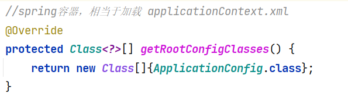

## 简介

使用SpringMVC集成了Spring Security，进行用户登录的认证和授权，没有实现保持会话的功能，登录界面和退出登录都是使用Spring Security自带的界面。使用基于内存的查询方式；

**1、Spring Security介绍**

Spring Security是一个能够为基于Spring的企业应用系统提供声明式的安全访问控制解决方案的安全框架。由于它 是Spring生态系统中的一员，因此它伴随着整个Spring生态系统不断修正、升级，**在spring boot项目中加入spring** **security更是十分简单**，使用Spring Security 减少了为企业系统安全控制编写大量重复代码的工作。

**2、创建工程** 

**2.1 创建maven工程**

1) 创建maven工程 security-spring-security，工程结构如下：

2）引入以下依赖：

在springmvc_session项目的基础上增加spring-security的依赖：

**2.2 Spring容器配置** 

同springmvc_session项目.

**2.3 Servlet Context配置**

同springmvc_session项目.

**2.4 加载 Spring容器**

在init包下定义Spring容器初始化类SpringApplicationInitializer，此类实现WebApplicationInitializer接口，Spring容器启动时加载WebApplicationInitializer接口的所有实现类。

上面图片中给出的都是和springmvc_session项目相同之处，其余的都是可能需要修改的。比如：上上图中WebConfig.java类中，springmvc_session项目中有对拦截器的注入使用@Autowire注解标注的一行，此时就要换用SpringSecurity的功能，所以删除；

 

所以SpringMVC的项目配置就是这些，三个配置文件基本配置已经配置好了，如果添加功能就可以在这些配置文件中补充；

**3、认证**

**3.1 认证页面**

springSecurity默认提供认证页面，不需要额外开发。

**3.2.安全配置**

**spring security提供了用户名密码登录、退出、会话管理等认证功能，只需要配置即可使用**。上个项目的SpringMVC中这些操作需要我们手动实现；

**1)** 在config包下定义WebSecurityConfig，这个类名无所谓，主要是需要继承这个WebSecurityConfigurerAdapter类。

在这个类中需要配置三个东西，配置安全配置的内容包括：用户信息服务、密码编码器、安全拦截机制。

这个@EnableWebSecurity是开启SpringMVC的SpringSecurity机制，在SpringBoot中不需要添加此注解；

UserDetailsService是用来查询用户信息的类，可以使用默认，也可以自定义这个类；我们在上个SpringMVC项目中自己实现查询，而SpringSecurity替我们实现了这个查询，我们只需要告诉SpringSecurity是从内存查还是数据库查；

此处先使用SpringSecurity提供的UserDetailsService类，从内存查数据信息；后面还可以设置信息的格式，或者从数据库查数据信息；

- 在userDetailsService()方法中，我们返回了一个UserDetailsService给spring容器，Spring     Security会使用它来获取用户信息。
- 我们暂时使用InMemoryUserDetailsManager实现类，并在其中分别创建了zhangsan、lisi两个用     户，并设置密码和权限。
- 这里的User也是SpringSecurity给我们提供的用户信息类；
- 密码编码器的作用

用户输入的密码信息格式可能与我们从数据库获取或内存中获取的形式不同，如某一方通过了Hash加密，所以密码编码提供给我们进行密码的操作和比对；

- 而在configure()中，我们通过HttpSecurity设置了安全拦截规则，其中包含了以下内容：     

（1）url匹配/r/**的资源，经过认证后才能访问。

（2）其他url完全开放。

（3）支持form表单认证，认证成功后转向/login-success。

 关于HttpSecurity的配置清单请参考附录HttpSecurity。

2) 加载 WebSecurityConfig

在加载Spring容器的这个配置文件（web.xml）中配置，即在类SpringApplicationInitializer.java中配置；原来SpringMVC中，为：

修改SpringApplicationInitializer的getRootConfigClasses()方法，添加WebSecurityConfig.class：

**3.3****.Spring Security初始化**

Spring需要初始化，而**SpringSecurity****也是需要初始化的**；

Spring Security初始化，这里有两种情况 

- 若当前环境没有使用Spring或Spring     MVC，则需要将 WebSecurityConfig(Spring Security配置类) 传入超类，以确保获取配置，并创建spring     context。即下面的super方法；
- 相反，若当前环境已经使用spring，我们**应该在现有的springContext中注册Spring Security**(上一步已经做将     WebSecurityConfig加载至rootcontext)，此方法可以什么都不做，只需要注释super即可。

在init包下定义SpringSecurityApplicationInitializer：

**总结：**如果属于第一种情况，没有使用Spring或者SpringMVC就要取消注释这个super()方法。如果使用到了Spring，就要将Super()方法注释掉；

**3.****5.****默认根路径请求**

**在WebConfig.java中添加默认请求根路径跳转到/login**，此url为spring security提供：

spring security给我们提供了默认的登录页面。 

使用redirect:/login的作用是

因为SpringSecurity为我们提供了登录页面，当我们初次进入项目页面的时候就是进入了 SpringSecurity提供的登录页面。然而如果我们使用setViewName("/login");我们想从页面回到登录页面时，这个方法返回的就是login.jsp视图，然后我们并没有定义这个视图，因为它是SpringSecurity提供的，所以我们需要使用redirect去通知它返回login视图；

如果加上redirect:只有/login，那么返回的就是login.jsp视图，如果系统中存在这个视图就没事，如果不存在就会报错。因为本实验使用的是SpringSecurity提供的默认登录所以需要加上，如果不加并且没有定义login.jsp:

**3.6****.认证成功页面**

在安全配置中，认证成功将跳转到/login-success，代码如下：

spring security支持form表单认证，认证成功后转向/login-success。 在LoginController中定义/login-success:

**拓展：**

对于这种就是无论访问根目录下什么页面都是需要先登录的；

**3.7.****测试**

（1）启动项目，访问http://localhost:8080/security-spring-security/路径地址

页面会根据WebConfig中addViewControllers配置规则，跳转至/login，/login是pring Security提供的登录页面。

（2）登录

1、输入错误的用户名、密码

2、输入正确的用户名、密码，登录成功

（3）退出

1、请求/logout退出

2、退出 后再访问资源自动跳转到登录页面 

 

**注意：此处没有实现保持会话功能；**

 

**4、授权**

实现授权需要对用户的访问进行拦截校验，校验用户的权限是否可以操作指定的资源，Spring Security默认提供授权实现方法。

首先创建多个资源：在LoginController添加/r/r1或/r/r2

在安全配置类WebSecurityConfig.java中配置授权规则：

- .antMatchers("/r/r1").hasAuthority("p1")表示：访问/r/r1资源的     url需要拥有p1权限。 
- .antMatchers("/r/r2").hasAuthority("p2")表示：访问/r/r2资源的     url需要拥有p2权限。

完整的WebSecurityConfig方法如下：

**注意这个权限校验顺序，如果把****.antMatchers("/r/\**").authenticated()****放在第一位，那么访问权限失效；**

 回顾：对用户的授权是在WebSecurityConfig.java中实现添加权限属性的。可以添加多个属性：

测试： 1、登录成功 

2、访问/r/r1和/r/r2，有权限时则正常访问，否则返回403（拒绝访问）

 

**5、小结**

通过快速上手，咱们使用Spring Security实现了认证和授权，Spring Security提供了基于账号和密码的认证方式，通过安全配置即可实现请求拦截，授权功能，Spring Security能完成的不仅仅是这些。